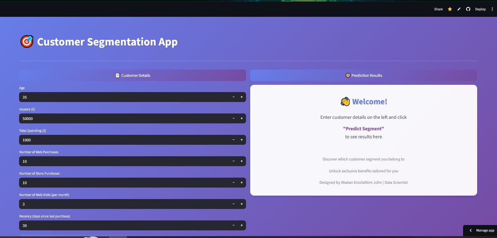
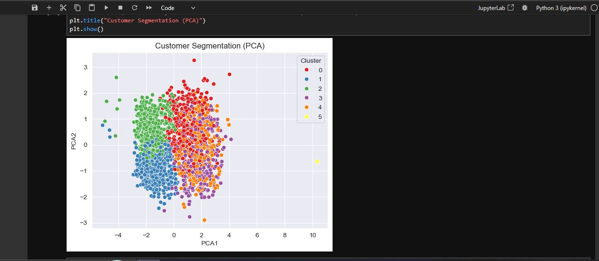

# 🎯 Customer Segmentation App

[](https://customer-segmentation-app-gxzappxzwy8x2w7t49xetn.streamlit.app/)
[](https://www.python.org/)

##  Live Demo
**Try it yourself:** [Customer Segmentation App](https://customer-segmentation-app-gxzappxzwy8x2w7t49xetn.streamlit.app/)

## 🎬 Demo Video

[](Demo.mp4)

*The video is too large to preview on GitHub. Click "View raw" to download and watch it locally.*

Or watch directly: [Demo.mp4](Demo.mp4)

## 📸 App Screenshots

### Customer Input Interface

*The main dashboard where users enter customer details - age, income, spending, and purchase behavior*

### Cluster Analysis Results

*Visual representation of the 6 customer segments*

## 🎯 The 6 Customer Segments

Based on analysis of **2,216 customers**, we identified these distinct segments:

| Cluster | Segment Name | Count | % | Average Spending |
|---------|--------------|-------|---|------------------|
| 0 | 🌟 Engaged Affluents | 420 | 19.0% | $875 |
| 1 | 🛒 Budget-Conscious Shoppers | 537 | 24.2% | $136 |
| 2 | ⏰ Recent Budget Shoppers | 574 | 25.9% | $118 |
| 3 | 👴 Traditional High-Spenders | 336 | 15.2% | $1,140 |
| 4 | 💎 Premium Store Shoppers | 348 | 15.7% | $1,304 |
| 5 | ⚠️ Outlier | 1 | 0.05% | $62 |

## 🛠️ How It Works

The app uses **K-Means Clustering** to analyze 7 key features:
- Age
- Annual Income
- Total Spending
- Number of Web Purchases
- Number of Store Purchases
- Web Visits per Month
- Recency (days since last purchase)

## 🚀 Getting Started

```bash
# Clone the repository
git clone https://github.com/abataneniola/customer-segmentation-app.git

# Install dependencies
pip install -r requirements.txt

# Run the app
streamlit run segmentation.py
```

## 👨‍💻 Author

**Abatan Eniola John**
- GitHub: [@abataneniola](https://github.com/abataneniola)
- Live Demo: [Customer Segmentation App](https://customer-segmentation-app-gxzappxzwy8x2w7t49xetn.streamlit.app/)

---

** Built with ❤️ using Machine Learning and Streamlit **
```

## To Update Your README:

```bash
# 1. Edit README.md and add the author section
# 2. Save the file
# 3. Commit and push:
git add README.md
git commit -m "Add author section with full name"
git push
```
